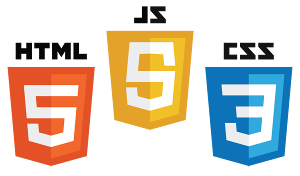
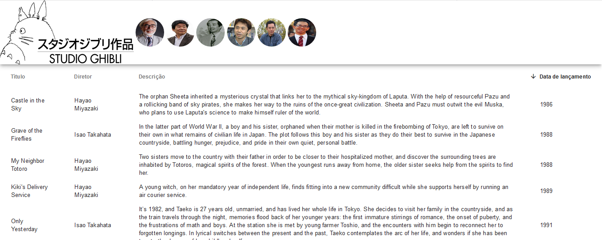

# Avaliação para a vaga de estágio na Cognos - Startup parceira da CSI locações
* **Autor: Fernando Nascimento** 
* **Contato: fernandodiego.sn@gmail.com**

## A avaliação consiste em consumir uma API, exibindo os dados em uma tela

## As regras são:

* Consumir esta API: https://ghibliapi.herokuapp.com/#tag/Films
* Utilizar o end point: GET /films
* Exibir informações sobre os filmes como: título, diretor, data de lançamento e descrição
* Utilizar javascript (De preferência framework Angular 4/5)
* Utilizar qualquer framework CSS (Preferência por Material-Angular)

## Esta versão foi criada utilizando as seguintes ferramentas:

* Node, utilizando o npm como nosso package manager
* Axios, HTTP client
* vue-material, CSS do vue baseado em material design
* Browserify, nos permite usar o padrão de módulos do NodeJS no navegador. Nós definimos as dependências e depois o Browserify empacota tudo isso em apenas um arquivo JS
* browserify-css, transformação browserify que explica como carregar arquivo CSS
* Budo, servidor para desenvolvimento para dar reload na página automaticamente ao atualizar o código
* Vue,(pronounced /vjuː/, like view). Framework reativo javascript para criar interfaces modernas de usuário.
* [Comparação do vue com outros frameworks JS!](https://vuejs.org/v2/guide/comparison.html)
* vue-material, implementação do material design para o vue
* vueify, transformação browserify para empacotar arquivos .vue

 

## Configurando o ambiente

* [Instalar o node!](https://nodejs.org/en/download/)
* Checkout neste projeto
* Na pasta client, abra o terminal e utilize o comando npm install
* Pronto! Ambiente configurado
* Na pasta client, pelo terminal execute o comando npm run dev
* E é isso. =)

## Resultado da tela

## Extra
* Como desafio eu resolvi tentar fazer além do vue, em angular também
* Tive dificuldades, mas com muita pesquisa (Encontrei bons exemplos) consegui alguma coisa
* Podem conferir aqui neste [repositório!](https://github.com/fernandiego/avaliacao-cognos-angular)